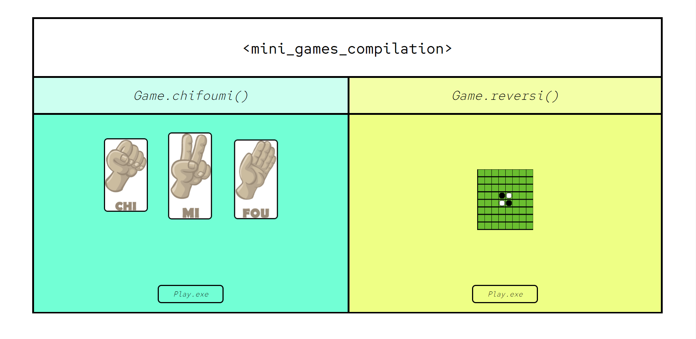
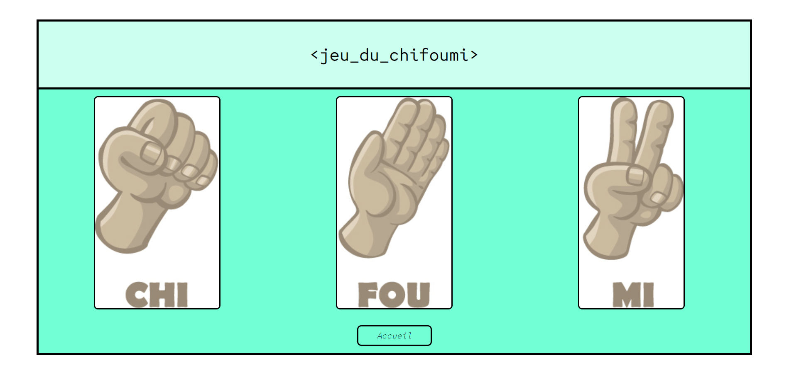
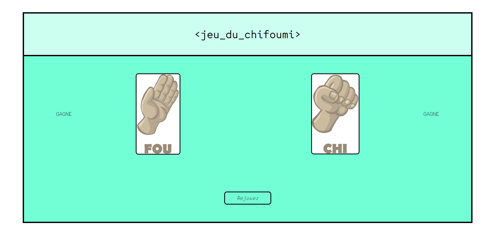
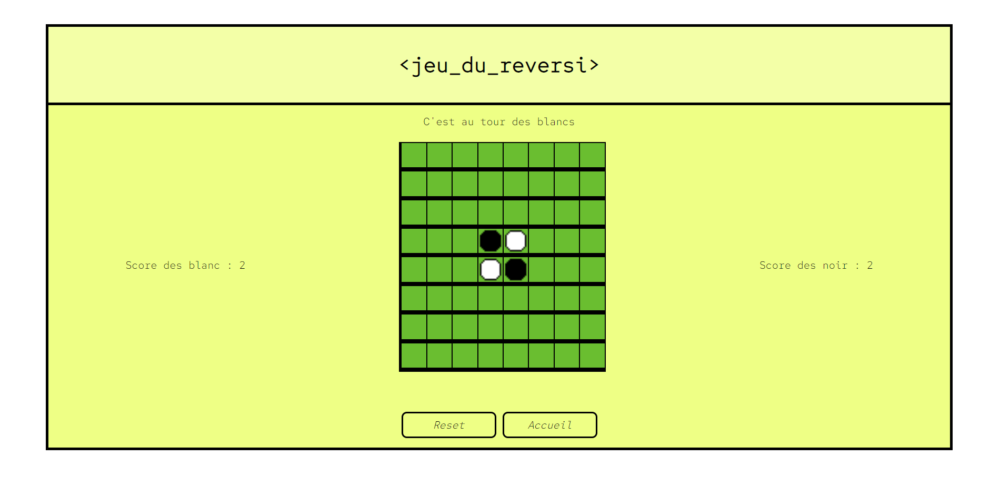

# Jeu du reversi et du chifoumi sous forme d'application web

---

Serveur : tomcat 9

SDK : 11

---

## Page index :

Page d'accueil de l'application, choix entre les deux jeu Reversi ou Chifoumi.

## Jeu du chifoumi : 

Ecran de choix pour le Chifoumi, le parametre sera envoyer a la page suivante.

Ecran du résultat, la servlet compare le paramatre reçu avec le choix pseudo 
aleatoire qu'elle a fait et renvoie le résultat de la comparaison a cette page.

## Jeu du reversi :

Ecran du jeu Reversi, ce joue a 2 joueurs, les blancs commence, il suffit de 
cliquer sur la case que l'on souhaite occupé, si cela est possible le jeu est 
mis à jour, sinon on doit réessayer.